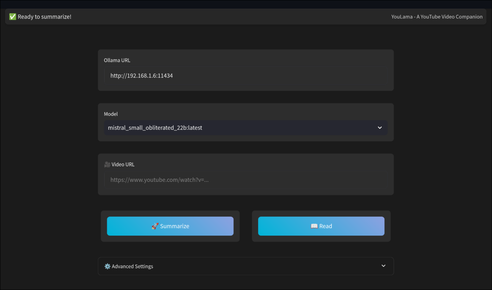

# YouTube Summarizer by TCSenpai

[](https://justforfunnoreally.dev)

YouTube Summarizer is a Streamlit-based web application that allows users to generate summaries of YouTube videos using AI-powered language models and optionally Whisper for transcription.

- [YouTube Summarizer by TCSenpai](#youtube-summarizer-by-tcsenpai)
  - [Features](#features)
  - [Installation](#installation)
  - [Usage](#usage)
  - [Global Installation](#global-installation)
  - [Run with the included binary](#run-with-the-included-binary)
  - [Dependencies](#dependencies)
  - [Project Structure](#project-structure)
  - [Contributing](#contributing)
  - [License](#license)
  - [Credits](#credits)



## Features

- Supports multiple YouTube frontends (e.g. YouTube, Invidious, etc.)
- Fetch and cache YouTube video transcripts
- Summarize video content using Ollama AI models
- Display video information (title and channel)
- Customizable Ollama URL and model selection
- Fallback to Whisper for transcription if no transcript is found
- Customizable Whisper URL and model selection
- Optional force Whisper transcription

## Installation

1. Clone the repository:

   ```
   git clone https://github.com/yourusername/youtube-summarizer.git
   cd youtube-summarizer
   ```

2. Install the required dependencies:

   ```
   pip install -r requirements.txt
   ```

3. Set up environment variables:
   Create a `.env` file in the root directory and add the following:

   ```
   YOUTUBE_API_KEY=your_youtube_api_key
   OLLAMA_MODEL=default_model_name
   WHISPER_URL=http://localhost:8000/
   WHISPER_MODEL=Systran/faster-whisper-large-v3
   ```

   - Note: you can copy the `env.example` file to `.env` and modify the values.
   - Important: the `WHISPER_URL` should point to the whisper server you want to use. You can leave it as it is if you are not planning on using Whisper.

## Usage

1. Run the Streamlit app:

   ```
   streamlit run src/main.py
   ```

2. Open your web browser and navigate to the provided local URL (usually `http://localhost:8501`).

3. Enter a YouTube video URL in the input field.

4. (Optional) Customize the Ollama URL and select a different AI model.
5. (Optional) Customize the Whisper URL and select a different Whisper model.

6. Click the "Summarize" button to generate a summary of the video.

## Global Installation

You can install the application globally on your system by running the following command:

```
sudo ./install.sh
```

This will create a new command `youlama` that you can use to run the application.

## Run with the included binary

You can also run the application with the included binary:

```
./youlama
```

## Dependencies

- Streamlit
- Pytube
- Ollama
- YouTube Data API
- Python-dotenv
- pytubefix
- Gradio

## Project Structure

- `src/main.py`: Main Streamlit application
- `src/ollama_client.py`: Ollama API client for model interaction
- `src/video_info.py`: YouTube API integration for video information
- `src/whisper_module.py`: Whisper API client for transcription
- `src/yt_audiophile.py`: Audio downloader for YouTube videos
- `transcript_cache/`: Directory for caching video transcripts
- `downloads/`: Directory for downloaded audio files, might be empty

## Contributing

Contributions are welcome! Please feel free to submit a Pull Request.

## License

WTFPL License

## Credits

Icon: "https://www.flaticon.com/free-icons/subtitles" by Freepik - Flaticon
